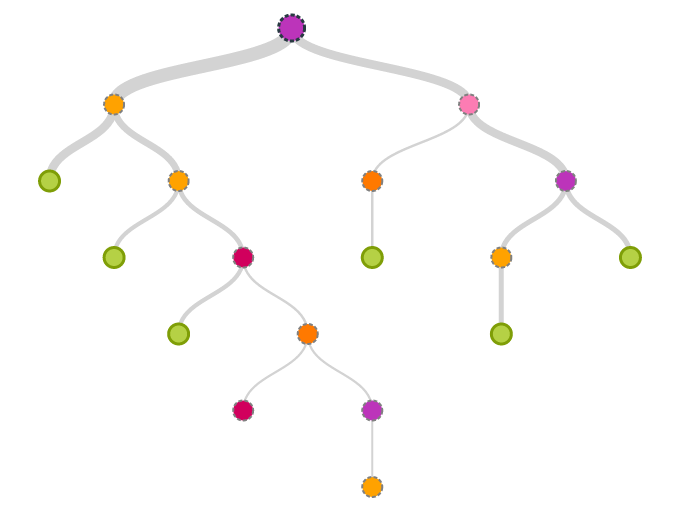

<h2 align="center">
  Raw ML Classifiers
</h2>

<p align="center">
  <a href="https://github.com/arkilpatel/Raw-ML-Classifiers/blob/main/LICENSE">
    
  </a>
</p>


This repository contains implementations of six Machine Learning Classifiers using only standard Python libraries such as NumPy and Pandas.


#### Dependencies

- compatible with python 3.6

#### Models

The current repository includes 6 implementations of Models:

- Naïve Bayes Classifier at `./src/naive_bayes.py`
- Decision Tree at `./src/decision_tree.py`
- Logistic Regression at `./src/logistic_regression.py`
- Random Forest at `./src/random_forest.py`
- Adaboost at `./src/adaboost.py`
- Stacking at `./src/stacking.py`

## Documentation:

#### Naïve Bayes Classifier

<h2 align="center">
  
</h2>

```python
class NaiveBayes(type = “Gaussian”, prior = None)
```

This class implements Naïve Bayes with Gaussian and Multinomial types.

<table>
<tr>
    <td>Parameters</td>
    <td><b>type:</b> str, ‘Gaussian’ or ‘Multinomial’, default: ‘Gaussian’ <br> Specifies which type ‘Gaussian’ or ‘Multinomial’ is to be used. <br> <br>
<b>prior:</b> array-like, shape (n_classes,) <br> Prior probabilities of the classes. If specified the priors are not adjusted according to the data.
</td>
</tr>
<tr>
    <td>Attributes</td>
    <td><b>class_log_prior:</b> array, shape(n_classes) <br> Prior probability of each class._
</td>
</tr>
</table>
##### Methods:

```python
def fit(X, y)
```

Fit the model according to the given training data.

<table>
<tr>
    <td>Parameters</td>
    <td><b>X:</b> {array-like, sparse matrix}, shape = (n_samples, n_features) <br> Training Vector where n_samples is the number of samples and n_features is the number of features. <br> <br>
<b>y:</b> array-like, shape = (n_samples,) <br> Target vector relative to X.
</td>
</tr>
<tr>
    <td>Returns</td>
    <td><b>self:</b> Object of class NaiveBayes
</td>
</tr>
</table>

```python
def predict(X)
```

Get the class predictions.

<table>
<tr>
    <td>Parameters</td>
    <td><b>X:</b> {array-like, sparse matrix}, shape = (n_samples, n_features) <br> Input Vector where n_samples is the number of samples and n_features is the number of features.
</td>
</tr>
<tr>
    <td>Returns</td>
    <td><b>C:</b> array-like, shape = (n_samples) <br> Predicted class label per sample.
</td>
</tr>
</table>


#### Decision Tree

<h2 align="center">
  
</h2>

```python
class DecisionTree(max_depth = 1,split_val_metric = 'mean', min_info_gain = 0.0, 
                   split_node_criterion = 'gini')
```

This class implements the Decision Tree Classifier.

<table>
<tr>
    <td>Parameters</td>
    <td><b>max_depth:</b> int, default: 1 <br> The maximum depth upto which the tree is allowed to grow. <br> <br>
<b>split_val_metric:</b> str, ‘mean’ or ‘median’, default: ‘mean’ <br> This is the value of the column selected on which you make a binary split. <br> <br>
<b>min_info_gain:</b> float, default: 0.0 <br> Minimum value of information gain required for node to split. <br> <br>
<b>split_node_criterion:</b> str, ‘gini’ or ‘entropy’, default: ‘gini’ <br> Criterion used for splitting nodes.
</td>
</tr>
</table>
##### Methods:

```python
def build_tree(X, y, sample_weights)
```

Build the Decision Tree according to the given data.

<table>
<tr>
    <td>Parameters</td>
    <td><b>X:</b> {array-like, sparse matrix}, shape = (n_samples, n_features) <br> Training Vector where n_samples is the number of samples and n_features is the number of features. <br> <br>
<b>y:</b> array-like, shape = (n_samples,) <br> Target vector relative to X. <br> <br>
<b>sample_weight:</b> array-like, shape = [n_samples] or None <br> Sample weights. If None, then samples are equally weighted. Splits that would create child nodes with net zero or negative weight are ignored while searching for a split in each node. Splits are also ignored if they would result in any single class carrying a negative weight in either child node.
</td>
</tr>
<tr>
    <td>Returns</td>
    <td><b>self:</b> Object of class DecisionTree
</td>
</tr>
</table>
```python
def predict_new(X)
```

Get the class predictions.

<table>
<tr>
    <td>Parameters</td>
    <td><b>X:</b> {array-like, sparse matrix}, shape = (n_samples, n_features) <br> Input Vector where n_samples is the number of samples and n_features is the number of features.
</td>
</tr>
<tr>
    <td>Returns</td>
    <td><b>C:</b> array-like, shape = (n_samples) <br> Predicted class label per sample.
</td>
</tr>
</table>


#### Logistic Regression

<h2 align="center">
  
</h2>

```python
class LogisticRegression(regulariser = 'L2', lamda = 0.0, num_steps = 100000, learning_rate = 0.1, 									initial_wts = None, verbose=False)
```

This class implements the Logistic Regression Classifier with L1 and L2 regularisation.

<table>
<tr>
    <td>Parameters</td>
    <td><b>regulariser:</b> str, ‘L1’ or ‘L2’, default: ‘L2’ <br> Specifies whether L1 or L2 norm is to be used for regularisation. <br> <br>
<b>lamda:</b> float, default: 0.0 <br> Hyperparameter for regulariser term. Default value indicates no regularisation is to be done. Directly proportional to regularisation strength. <br> <br>
<b>num_steps:</b> int, default: 100000 <br> Number of iterations for which Gradient Descent will run. <br> <br>
<b>learning_rate:</b> float, default: 0.1 <br> Indicates the size of step taken for Gradient Descent. <br> <br>
<b>initial_wts:</b> array, shape(n_features+1,), default: None <br> A list of n+1 values, where n is number of features. This is the initial value of the     coefficients. If None, values of list assigned randomly in range normal (0,1). <br> <br>
<b>verbose:</b> bool, default: False <br> Whether to display loss after every 1000 iterations.
</td>
</tr>
<tr>
    <td>Attributes</td>
    <td><b>theta_:</b> array, shape(n_features,) <br> A list of weights. <br> <br>
        <b>bias_:</b> int <br> Bias term for Logistic Regression equation. <br> <br>
        <b>para_theta_:</b> dictionary, {(class, theta_)} <br> A dictionary with the weights corresponding to each class. <br> <br>
        <b>para_bias_:</b> dictionary, {(class, bias_)} <br> A dictionary with the biases corresponding to each class. <br> <br>
        <b>hypothesis:</b> dictionary, {(class, probs)} <br> A dictionary with the probabilities of each sample corresponding to each class.
</td>
</tr>
</table>

##### Methods:

```python
def fit(X, y)
```

Fit the model according to the given training data.

<table>
<tr>
    <td>Parameters</td>
    <td><b>X:</b> {array-like, sparse matrix}, shape = (n_samples, n_features) <br> Training Vector where n_samples is the number of samples and n_features is the number of features. <br> <br>
<b>y:</b> array-like, shape = (n_samples,) <br> Target vector relative to X.
</td>
</tr>
<tr>
    <td>Returns</td>
    <td><b>self:</b> Object of class NaiveBayes
</td>
</tr>
</table>
```python
def predict_prob(X)
```

Returns probability estimates for all classes ordered by label of classes.

<table>
<tr>
    <td>Parameters</td>
    <td><b>X:</b> {array-like, sparse matrix}, shape = (n_samples, n_features) <br> Input Vector where n_samples is the number of samples and n_features is the number of features.
</td>
</tr>
<tr>
    <td>Returns</td>
    <td><b>T:</b> array-like, shape = (n_samples, class) <br> Returns the class for each sample according to whether n_classes>2 or not.
</td>
</tr>
</table>
```python
def predict(X)
```

Predicts the class labels for samples in X.

<table>
<tr>
    <td>Parameters</td>
    <td><b>X:</b> {array-like, sparse matrix}, shape = (n_samples, n_features) <br> Input Vector where n_samples is the number of samples and n_features is the number of features.
</td>
</tr>
<tr>
    <td>Returns</td>
    <td><b>C:</b> array-like, shape = (n_samples) <br> Predicted class label per sample.
</td>
</tr>
</table>


#### Random Forest

<h2 align="center">
  
</h2>

```python
class RandomForest(n_trees=10, max_depth=5, split_val_metric='mean', min_info_gain=0.0, 										split_node_criterion='gini', max_features=5, bootstrap=True, n_cores=1)
```

This class implements the Random Forest Classifier.

<table>
<tr>
    <td>Parameters</td>
    <td><b>n_trees:</b> int, default: 10 <br> Number of estimator trees to build the ensemble. <br> <br>
<b>max_depth:</b> int, default: 1 <br> The maximum depth upto which the tree is allowed to grow. <br> <br>
<b>split_val_metric:</b> str, ‘mean’ or ‘median’, default: ‘mean’ <br> This is the value of the column selected on which you make a binary split. <br> <br>
<b>min_info_gain:</b> float, default: 0.0 <br> Minimum value of information gain required for node to split. <br> <br>
<b>split_node_criterion:</b> str, ‘gini’ or ‘entropy’, default: ‘gini’ <br> Criterion used for splitting nodes. <br> <br>
<b>max_features:</b> int, default: 5 <br> The number of features to consider when looking for the best split. <br> <br>
<b>bootstrap:</b> bool, default: True <br> Whether bootstrap samples are to be used. If False, the whole dataset is used to build each tree. <br> <br>
<b>n_cores:</b> int, default: 1 <br> Number of cores on which to run this learning process.
</td>
</tr>
</table>

##### Methods:

```python
def fit_predict(X_train, y_train, X_test)
```

Fits the model according to the given training data and predicts the class label for sample X_test.

<table>
<tr>
    <td>Parameters</td>
    <td><b>X_train:</b> {array-like, sparse matrix}, shape = (n_samples, n_features) <br> Training Vector where n_samples is the number of samples and n_features is the number of features. <br> <br>
<b>y_train:</b> array-like, shape = (n_samples,) <br> Target vector relative to X. <br> <br>
<b>X_test:</b> {array-like, sparse matrix}, shape = (n_samples, n_features) <br> Input Vector where n_samples is the number of samples and n_features is the number of features.
</td>
</tr>
<tr>
    <td>Returns</td>
    <td><b>C:</b> array-like, shape = (n_samples) <br> Predicted class label per sample.
</td>
</tr>
</table>


#### Adaboost

<h2 align="center">
  
</h2>


```python
class AdaboostClassifier(max_depth = 1, n_trees = 10, learning_rate = 0.1)
```

This class implements Adaboost for Multiclass Classification.

<table>
<tr>
    <td>Parameters</td>
    <td><b>max_depth:</b> int, default: 1 <br> The maximum depth upto which the tree is allowed to grow. <br> <br>
<b>n_trees:</b> int, default: 10 <br> Number of estimator trees to build the ensemble. <br> <br>
<b>learning_rate:</b> float, default: 0.1 <br> Used in calculating error weights.
</td>
</tr>
<tr>
    <td>Attributes</td>
    <td><b>trees_:</b> list, shape: (n_trees,) <br> A list of tree estimators. <br> <br>
        <b>tree_weights_:</b> array, shape: (n_trees,) <br> Weights of tree estimators. <br> <br>
        <b>tree_errors_:</b> array, shape: (n_trees,) <br> Used to store errors for tree estimators. <br> <br>
        <b>n_classes:</b> int <br> Number of disctinct classes. <br> <br>
        <b>classes_:</b> array, shape: (n_classes,) <br> Array of class labels. <br> <br>
        <b>n_samples:</b> int <br> Number of sample examples under consideration.
</td>
</tr>
</table>
##### Methods:

```python
def fit(X, y)
```

 Fit the model according to given training data.

<table>
<tr>
    <td>Parameters</td>
    <td><b>X:</b> {array-like, sparse matrix}, shape = (n_samples, n_features) <br> Training Vector where n_samples is the number of samples and n_features is the number of features. <br> <br>
<b>y:</b> array-like, shape = (n_samples,) <br> Target vector relative to X. 
</td>
</tr>
<tr>
    <td>Returns</td>
    <td><b>self:</b> Object of class AdaboostClassifier
</td>
</tr>
</table>

```python
def predict(X)
```

Predicts the class labels for samples in X.

<table>
<tr>
    <td>Parameters</td>
    <td><b>X:</b> {array-like, sparse matrix}, shape = (n_samples, n_features) <br> Input Vector where n_samples is the number of samples and n_features is the number of features.
</td>
</tr>
<tr>
    <td>Returns</td>
    <td><b>C:</b> array-like, shape = (n_samples) <br> Predicted class label per sample.
</td>
</tr>
</table>


#### Stacking

<h2 align="center">
  
</h2>

```python
class Stack([(clf, count)])
```

This class implements the Stacking Ensemble Classifier.

<table>
<tr>
    <td>Parameters</td>
    <td><b>[(clf, count)]:</b> list of tuples <br> First element of each tuple is a Classifier object.
Second element of each tuple is how many times it is to be considered.</td>
</tr>
</table>

##### Methods:

```python
def fit_pred(X_train, X_test, y_train)
```

Fits the model according to the given training data and predicts the class label for sample X_test.

<table>
<tr>
    <td>Parameters</td>
    <td><b>X_train:</b> {array-like, sparse matrix}, shape = (n_samples, n_features) <br> Training Vector where n_samples is the number of samples and n_features is the number of features. <br> <br>
<b>y_train:</b> array-like, shape = (n_samples,) <br> Target vector relative to X. <br> <br>
<b>X_test:</b> {array-like, sparse matrix}, shape = (n_samples, n_features) <br> Input Vector where n_samples is the number of samples and n_features is the number of features.
</td>
</tr>
<tr>
    <td>Returns</td>
    <td><b>C:</b> array-like, shape = (n_samples) <br> Predicted class label per sample.
</td>
</tr>
</table>


For any clarification, comments, or suggestions please contact [Arkil](http://arkilpatel.github.io/).
